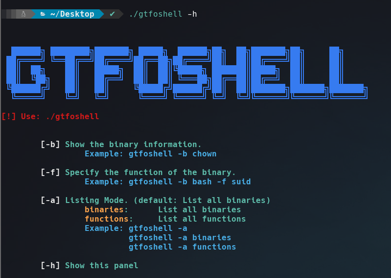
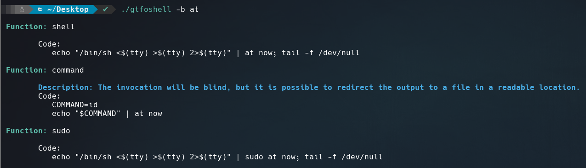
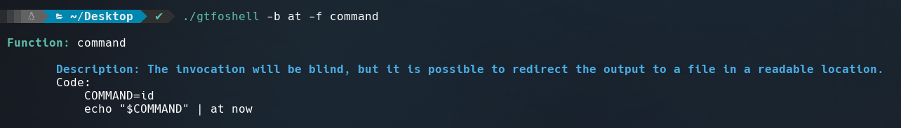
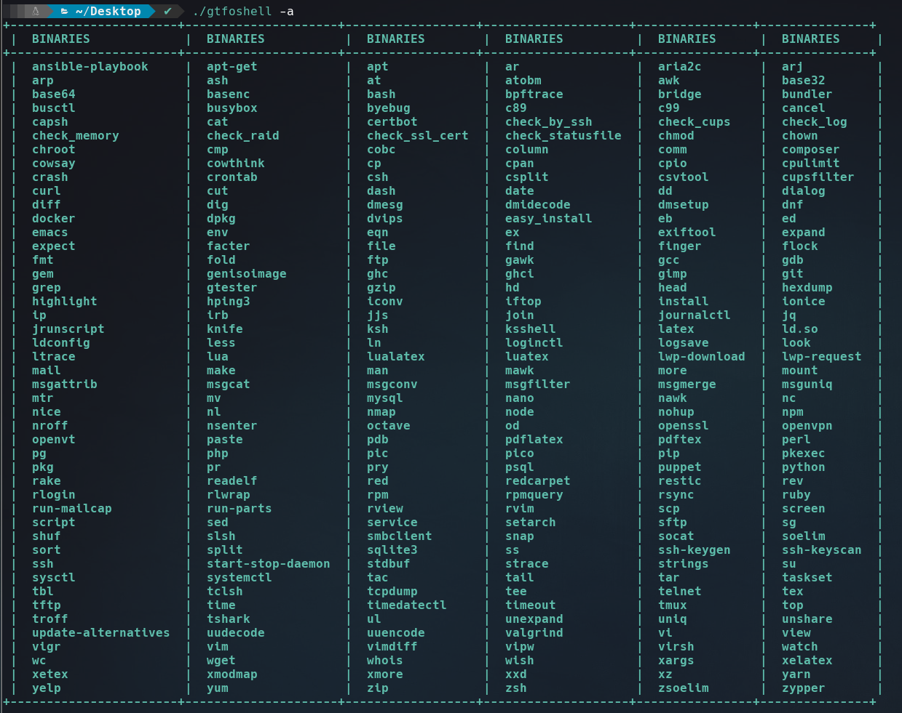
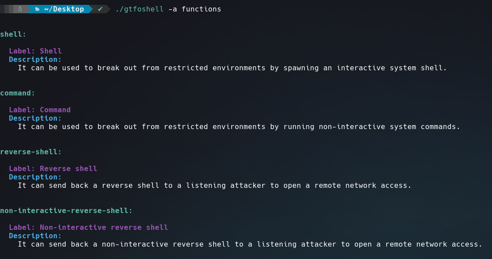

# GTFOShell
**GTFOShell** is a tool made in Bash, ideal for working comfortably from console searching binaries information on GTFOBins.

Usage
======
* Show help panel: 
  `./gtfoshell -h`

* Show binary information: 
  `./gtfoshell -b at`

* Specify function of the binary: 
  `./gtfoshell -b at -f command`

* List all binaries on GTFOBins: 
  `./gtfoshell -a` or 
  `./gtfoshell -a binaries`

* Show functions information: 
  `./gtfoshell -a functions`
  

